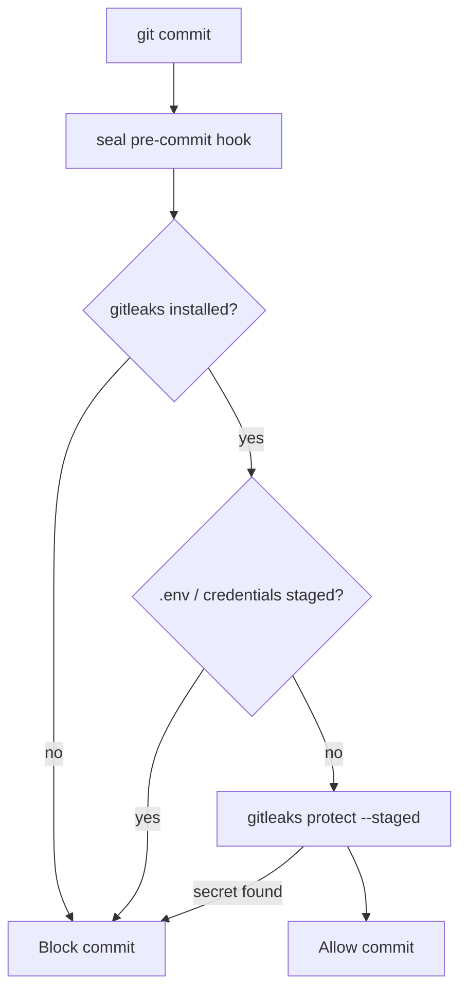

# seal

[](https://github.com/ahmifte/seal/actions/workflows/ci.yml)
[](./LICENSE)

A lightweight, installable **pre-commit hook** that blocks accidental secrets, API keys, and private env files before they reach git.

Requires [gitleaks](https://github.com/gitleaks/gitleaks) — no commits go through without it.

## What it catches

- **Blocked files:** `.env`, `.env.local`, `credentials.json`, `*.pem`, private keys
- **Secret scan:** 100+ rules via gitleaks + extended [`gitleaks.toml`](gitleaks.toml) (Stripe, OpenAI, GitHub, AWS, Slack, and more)

`.env.example` and documented placeholders are allowlisted.

## Prerequisites

```bash
brew install gitleaks
```

The hook refuses to run if gitleaks is missing. `install.sh` checks for it too.

## Quick install (any repo)

```bash
git clone https://github.com/ahmifte/seal.git
./seal/scripts/install.sh /path/to/your/repo
```

This sets `core.hooksPath=.githooks`, copies the hook + config, and patches `.gitignore` if needed.

### Install into all five AI projects at once

```bash
./seal/scripts/install-all.sh
```

Expects repos under `~/projects/` (`folio`, `flowforge`, `distill`, `pathfinder`, `aikit`).

## Alternative: pre-commit framework

If you already use [pre-commit](https://pre-commit.com):

```bash
pre-commit install
```

Uses [`.pre-commit-config.yaml`](.pre-commit-config.yaml) with gitleaks + env-file blocking.

## How it works



## Uninstall

```bash
git config --unset core.hooksPath
rm -rf .githooks
```

## License

MIT — see [LICENSE](./LICENSE).
